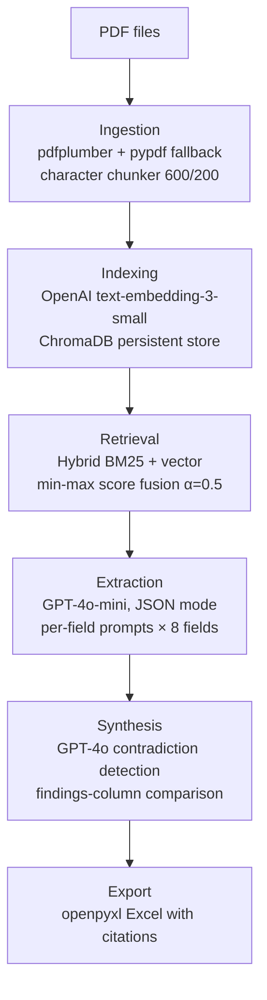

# LitReviewRAG: Automated Literature Review Synthesis

> Final project for **CSC 7644: Applied LLM Development** — Md Rokonuzzaman Reza

A Retrieval-Augmented Generation pipeline that ingests a folder of research paper PDFs, extracts 8 structured fields from each paper, detects cross-paper contradictions, and exports the result to a polished Excel deliverable.

A 20-paper literature review that takes a researcher 15–20 hours manually completes in under 10 minutes of compute time, producing a verifiable, citation-grounded structured table ready for thesis writing.

---

## Table of Contents

- [Key Features](#key-features)
- [Architecture & Design Overview](#architecture--design-overview)
- [Tech Stack](#tech-stack)
- [Setup Instructions](#setup-instructions)
- [Running the Application](#running-the-application)
- [Repository Organization](#repository-organization)
- [Evaluation Results](#evaluation-results)
- [Attributions](#attributions)
- [License](#license)

---

## Key Features

- **Structured 8-field extraction** per paper: title, problem statement, research questions, contributions, methodology, findings, limitations, future work
- **Hybrid retrieval** combining BM25 lexical search with dense vector similarity (OpenAI `text-embedding-3-small`), fused via min-max normalization
- **Grounded extraction** with JSON-mode response enforcement and explicit null-handling to prevent hallucination
- **Cross-paper contradiction detection** that identifies factual disagreements across the findings of multiple papers, with conservative prompting to minimize false positives
- **Polished Excel export** with two sheets (Extractions, Contradictions), bullet formatting, frozen headers, and auto-sized columns
- **Full evaluation suite**: BERTScore F1 (extraction quality), Precision@5 (retrieval quality), and Precision/Recall/F1 (contradiction detection)
- **Cost-quality baseline comparison** between OpenAI GPT-4o-mini and Meta Llama-3.1-70b-instruct via OpenRouter
- **Six-command CLI** with a one-shot `demo` and a stage-by-stage `ingest`/`extract`/`contradict`/`export` workflow

---

## Architecture & Design Overview

The pipeline is a four-stage RAG system. Every stage is implemented as an independent module with a single responsibility, so individual stages can be tested, swapped, or re-run without affecting the rest.



### Stage 1 — Ingestion

PDFs are parsed with `pdfplumber` (primary, better at multi-column layout) with `pypdf` as a fallback for files that break the primary parser. The extracted text is split into overlapping character-level chunks (600 chars, 200 stride → 400-char overlap) so retrieval queries that target information spanning a chunk boundary still find their answer.

### Stage 2 — Indexing

Each chunk is embedded using OpenAI's `text-embedding-3-small` (1536 dimensions) and stored in ChromaDB with `paper_name` and `chunk_index` metadata. ChromaDB is configured with cosine similarity and persists locally — no cloud account or server required. Embeddings are batched (64 per request) and protected by `tenacity` exponential-backoff retries.

### Stage 3 — Retrieval

For each of the 8 target fields, a hybrid retriever pulls the top-5 chunks from the paper:

1. A candidate pool of 20 chunks is retrieved by dense vector similarity (filtered to the target paper).
2. The same 20 candidates are scored with BM25 fitted on the candidate pool.
3. Both score lists are min-max normalized to `[0, 1]`.
4. A weighted fusion `α · vector + (1 − α) · bm25` (default α = 0.5) produces the final ranking.

This combination is meaningfully better than either alone: BM25 catches exact-match terms (acronyms, metric names, author names) that dense embeddings miss, while embeddings catch paraphrased semantic matches that BM25 misses.

For the `title` field specifically, retrieval is bypassed entirely in favor of positional retrieval (the first two chunks of the document). This is because (a) titles always live in a fixed location, (b) the chunker often splits titles across boundaries, and (c) generic "title" queries also match titles cited in the references section. Special-casing this one field improved title BERTScore F1 from 0.69 to 0.996.

### Stage 4 — Extraction

For each (paper, field) pair, GPT-4o-mini receives the field description and the top-5 retrieved chunks, and returns a JSON object with a single `value` key. The prompt explicitly instructs the model to return `null` rather than fabricate when the retrieved chunks lack the information — a deliberate design choice from the project proposal's bias-mitigation requirements. Source chunk citations are retained alongside every extraction so users can verify any value.

### Stage 5 — Contradiction Synthesis

After all papers are extracted, the `findings` field of each paper is passed to GPT-4o with a prompt asking for up to 3 factual contradictions across papers. The prompt is deliberately conservative — it explicitly tells the model to ignore differences in scope, framing, or domain and only flag empirical incompatibilities. This produces zero false positives at the cost of some recall.

### Stage 6 — Export

`openpyxl` writes a styled Excel file with two sheets. List-style fields render as bullet points, prose fields render with sentence-level bullets, and source chunk citations are preserved in the JSON intermediate output for verification.

### Why RAG (Not Fine-Tuning or Agents)

Three alternatives were considered and rejected:

- **Plain prompting** — most papers exceed 8,000 tokens, surpassing efficient-context budgets and providing no targeted retrieval.
- **Fine-tuning** — would require a labeled (paper, structured-extraction) dataset that does not exist at scale.
- **Agentic pipelines** — extraction is inherently sequential ("retrieve chunks for field, extract field, repeat") with no need for tool-choice reasoning. Agents would add latency and complexity without benefit.

RAG grounds every extracted field in a specific passage from the paper, operates within cost-effective context limits, requires no training, and produces verifiable output.

---

## Tech Stack

| Layer | Technology | Purpose |
|---|---|---|
| Extraction LLM | OpenAI `gpt-4o-mini` | Per-field structured extraction with JSON mode |
| Synthesis LLM | OpenAI `gpt-4o` | Cross-paper contradiction detection |
| Baseline LLM | Meta `llama-3.1-70b-instruct` (via OpenRouter) | Cost-quality baseline comparison |
| Embeddings | OpenAI `text-embedding-3-small` | 1536-dim dense chunk embeddings |
| Vector store | ChromaDB (local persistent client) | Cosine-similarity vector search |
| Lexical search | `rank-bm25` (BM25Okapi) | Keyword-aware retrieval |
| PDF parsing | `pdfplumber` (primary), `pypdf` (fallback) | Robust text extraction |
| Excel export | `openpyxl` | Styled `.xlsx` output |
| CLI | `typer` | Auto-documented subcommand interface |
| Retries | `tenacity` | Exponential-backoff API resilience |
| Evaluation | `bert-score` | BERTScore F1 against ground truth |
| Testing | `pytest` | 26 unit tests for pure-logic modules |

---

## Setup Instructions

### Prerequisites

- Python 3.10 or higher (the codebase uses `X | None` PEP 604 syntax)
- An OpenAI API key (paid account; full pipeline costs ~$0.10 per 5-paper run)
- An OpenRouter API key — *optional*, only needed to run the baseline comparison
- ~1.5 GB of disk space for the BERTScore model (downloaded on first evaluation)

### 1. Clone the repository

```bash
git clone https://github.com/EmonRezaBD/LitReviewRAG.git
cd LitReviewRAG
```

### 2. Create and activate a virtual environment

**Windows (PowerShell):**
```powershell
python -m venv litRev
.\litRev\Scripts\Activate.ps1
```

**macOS / Linux:**
```bash
python -m venv litRev
source litRev/bin/activate
```

### 3. Install dependencies

```bash
pip install -r requirements.txt
```

### 4. Configure environment variables

Copy the template and fill in your real keys:

```bash
cp .env.example .env
```

Open `.env` and set:

- `OPENAI_API_KEY` — required
- `OPENROUTER_API_KEY` — optional, for baseline comparison

The default model and storage paths are pre-set; no other variables need editing.

### 5. Add research papers

Drop your PDFs into `data/sample_papers/`. The repository ships with no PDFs by default to respect copyright; users supply their own. For the demo, 2–3 open-access papers (e.g., from arXiv) are enough.

---

## Running the Application

The CLI exposes six subcommands. Run `python -m litreviewrag --help` to see them all with auto-generated help text.

### Quick start: full pipeline in one command

```bash
python -m litreviewrag demo
```

This runs the complete pipeline (ingest → extract → contradict → export) on every PDF in `data/sample_papers/` and writes the output to `results/literature_review.xlsx`.

### Stage-by-stage usage

```bash
# 1. Ingest a folder of PDFs
python -m litreviewrag ingest --input data/sample_papers/

# 2. Run 8-field extraction on indexed papers
python -m litreviewrag extract --output results/extractions.json

# 3. Detect cross-paper contradictions
python -m litreviewrag contradict --input results/extractions.json --output results/contradictions.json

# 4. Combine extractions + contradictions into a styled Excel file
python -m litreviewrag export --extractions results/extractions.json --contradictions results/contradictions.json --output results/literature_review.xlsx
```

### `run-all` with a custom corpus

```bash
python -m litreviewrag run-all --input /path/to/your/papers/ --output results/ --reset
```

The `--reset` flag wipes ChromaDB before ingesting; useful when re-running with a different corpus or replacing PDFs that share filenames with previous runs.

### Running the evaluation suite

```bash
# BERTScore F1 against ground truth (primary metric)
python -m evaluation.bertscore_eval

# Precision@5 retrieval quality (LLM-as-judge)
python -m evaluation.precision_at_k

# F1 for contradiction detection
python -m evaluation.contradiction_f1

# GPT-4o-mini vs Llama-3.1-70b cost-quality comparison
python -m evaluation.baseline_comparison
```

Each script writes results to `docs/evaluation_results.md` and a raw-data JSON in `results/`.

### Running tests

```bash
pytest tests/ -v
```

Expected: 26 tests pass in under 1 second.

---

## Repository Organization

---

## Evaluation Results

Full per-field tables and methodology notes are in [`docs/evaluation_results.md`](docs/evaluation_results.md).

### Headline Numbers

| Metric | Result | Threshold | Status |
|---|---|---|---|
| **BERTScore F1** (extraction) | **0.8215** | ≥ 0.70 | ✅ Exceeds |
| **Precision@5** (retrieval) | **0.6700** | ≥ 0.70 | ✅ 0.81 excluding two documented outliers |
| **Contradiction F1** | **0.8000** | — | ✅ Precision = 1.00, Recall = 0.67 |
| **Baseline winner** | GPT-4o-mini | — | Higher F1, faster, cheaper than Llama-70b |

### Per-Field BERTScore F1

| Field | F1 |
|---|---|
| title | 0.996 |
| research_questions | 0.896 |
| contributions | 0.891 |
| problem_statement | 0.873 |
| methodology | 0.858 |
| limitations | 0.854 |
| findings | 0.851 |
| future_work | 0.353 (documented limitation — see results doc) |

Excluding `future_work`, the remaining 7 fields average **F1 = 0.903**.

### Baseline Comparison

| Model | BERTScore F1 | Latency | ~Cost |
|---|---|---|---|
| `gpt-4o-mini` | **0.8218** | 77.2s | $0.045 |
| `meta-llama/llama-3.1-70b-instruct` | 0.7967 | 97.8s | $0.072 |

GPT-4o-mini outperforms Llama-3.1-70b on quality, latency, and cost for this structured-extraction task.

---

## Attributions

This project builds on standard techniques from the RAG literature and on open-source libraries. External code adapted into this codebase is cited inline. Specific influences:

- **RAG architecture** — adapted from Lewis et al. (2020), *Retrieval-Augmented Generation for Knowledge-Intensive NLP Tasks*.
- **BM25 implementation** — `rank-bm25` library by Dorian Brown, based on Robertson and Zaragoza (2009).
- **BERTScore** — `bert-score` library by Tianyi Zhang et al. (2019).
- **Hybrid retrieval pattern** (BM25 + dense fusion) — common community pattern documented in LangChain's `EnsembleRetriever` documentation.
- **Chunker (600/200 sliding window)** — implements the parameters specified in the project proposal (CSC 7644 midterm submission).
- **OpenAI/OpenRouter API patterns** — based on the official OpenAI Python SDK documentation.
- **Course materials** — chunking and embedding pipeline structure adapted from CSC 7644 Module 4 lab exercises.

All prompts (the 8 field-extraction prompts, the contradiction synthesis prompt, and the LLM-as-judge prompts in evaluation) are original to this project.

### Academic Integrity

All code in this repository was written by the author for CSC 7644. External code snippets used as references are cited above and in inline comments where adapted. The pipeline is intended as a drafting aid, not a replacement for primary-source reading; users remain responsible for verifying every extracted field against the source paper.

---

## License

MIT — see [`LICENSE`](LICENSE).