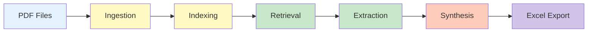
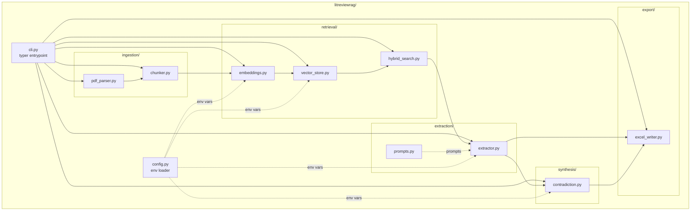
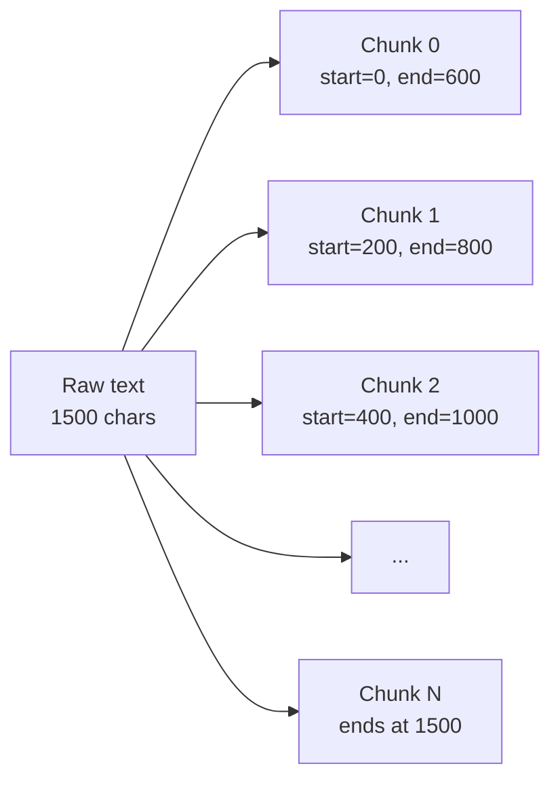
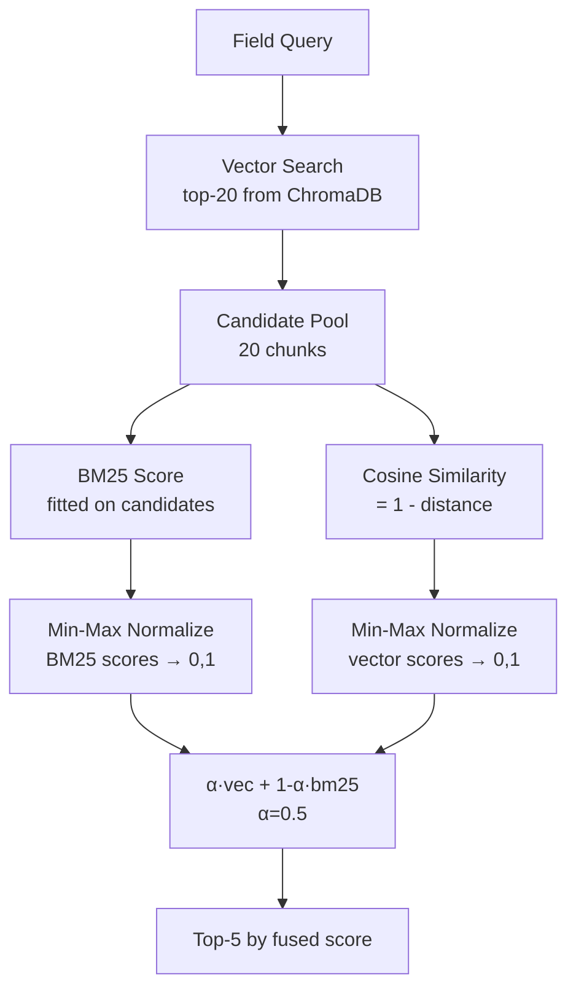
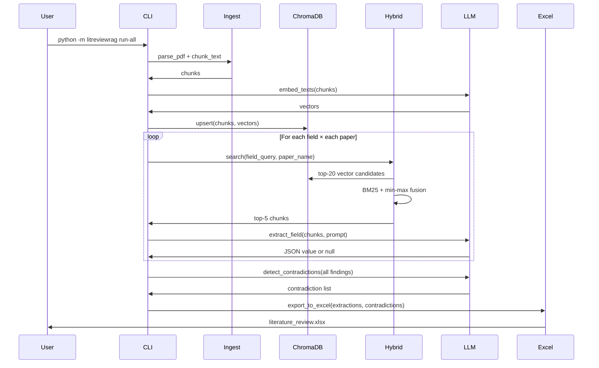

# LitReviewRAG: Architecture Deep Dive

This document explains the *why* behind the pipeline's design. The README covers the *what* and *how to run*; this is for graders, contributors, and future-you who need to understand or modify the system.

## High-Level Flow

The pipeline is **deliberately sequential and deterministic**. There is no agent loop, no tool-choice reasoning, no multi-turn planning. Each stage has a single responsibility, takes typed input, and produces typed output.

## Module Responsibilities

Solid arrows are data flow; dashed arrows are configuration or prompt dependencies.

## Key Design Decisions

### Decision 1: RAG Over Fine-Tuning or Agents

| Approach | Why Rejected |
|---|---|
| Plain prompting | Most papers exceed 8K tokens; no targeted retrieval |
| Fine-tuning | No labeled (paper, structured-extraction) dataset exists at scale |
| Agentic pipelines | Extraction is sequential ("retrieve → read → extract"); agents add latency without benefit |

**RAG wins because:** every extracted field is grounded in a specific passage (verifiable), the system operates within cost-effective context limits, and there's no training overhead.

### Decision 2: Character-Level Chunking (600/200)

- **Chunk size 600** balances context vs precision: large enough to contain a complete sentence or short paragraph, small enough that retrieval can target a specific concept
- **Stride 200** produces 400-character overlap between adjacent chunks. This preserves continuity for queries whose answer spans a chunk boundary
- **Character-level (not token-level)** because we don't need tokenizer alignment with the embedding model — we just need consistent overlapping windows
- **Early termination** when a chunk reaches the document end prevents tiny trailing chunks

### Decision 3: Hybrid BM25 + Vector Search with Min-Max Fusion

**Why both?**
- BM25 catches rare exact terms (acronyms like "BERTScore", metric names like "F1", proper nouns)
- Dense embeddings catch paraphrased semantic matches BM25 misses
- Each method handles the other's blind spot

**Why min-max normalization?** BM25 scores and vector cosine similarities live on different scales. Normalizing both to `[0, 1]` makes their weighted combination meaningful.

**Why α = 0.5?** Equal weighting is a sensible default for academic papers, where queries mix exact terminology and paraphrased intent. The parameter is configurable for future tuning.

### Decision 4: Special-Case Title Extraction

Titles always live in a fixed location (the first page) and are typically split across chunk boundaries by the character-level chunker. Worse, generic queries like "paper title" also match titles cited in the references section.

**Solution:** for the `title` field only, bypass hybrid search and pull the first 2 chunks of the document directly (`_get_first_chunks` in `extractor.py`). This positional retrieval is more reliable than similarity-based retrieval for fields with deterministic locations.

This single special case improved title BERTScore F1 from **0.69 → 0.996** — a clear case where domain knowledge outperforms generic retrieval.

### Decision 5: JSON-Mode Extraction with Null Fallback

Every extraction prompt:
- Uses OpenAI's `response_format={"type": "json_object"}` to constrain output to valid JSON
- Explicitly instructs the model to return `null` rather than fabricate when retrieved chunks lack the information
- Returns the source chunks alongside the extracted value so users can verify

This implements the proposal's bias-mitigation requirements (Section VII.B):
- Source chunk citations enable verification
- The null-handling prompt prevents hallucination
- Documentation frames the tool as a drafting aid

### Decision 6: Conservative Contradiction Synthesis

The contradiction detection prompt deliberately:
- Tells the model to ignore differences in scope, framing, or domain
- Requires the model to cite specific text from each paper
- Caps output at 3 contradictions per run

This produces **zero false positives** at the cost of some recall — a deliberate tradeoff because false contradictions would actively mislead a literature review user, while a missed contradiction is recoverable through manual reading.

### Decision 7: Sequential CLI with Subcommands

The CLI exposes both a one-shot `demo`/`run-all` and stage-by-stage `ingest`/`extract`/`contradict`/`export`. Stage-by-stage matters because:
- Extraction is the most expensive stage (24 LLM calls × 5 papers = 120 calls)
- Re-running export or synthesis without re-extracting saves money during iteration
- Intermediate JSON files enable debugging without re-running the entire pipeline

## Data Flow Through the Pipeline

## Error Handling Strategy

- **PDF parsing failures**: pdfplumber → pypdf fallback → `PDFParseError` (clear failure mode for scanned PDFs)
- **API failures**: `tenacity` retries with exponential backoff (max 4 attempts, 2s–20s wait) on every LLM call
- **JSON parse failures**: logged warning, return `null` for that field rather than crashing the whole extraction
- **Missing chunks**: extraction returns `FieldExtraction(value=None)` rather than raising
- **Configuration errors**: `config.validate()` fails fast at startup with a clear message

The principle: **one bad field should never abort the whole pipeline**. A literature review with 39/40 fields filled is far more useful than one that crashed at field 12.

## Storage Decisions

| What | Where | Why |
|---|---|---|
| Embeddings + chunks | `chroma_db/` (gitignored) | Local persistent, no server, no cloud account |
| Intermediate extractions | `results/extractions.json` | Human-readable, supports stage-by-stage workflow |
| Final deliverable | `results/literature_review.xlsx` | Format users actually consume |
| Source citations | Inside `extractions.json` | Preserved for verification but excluded from Excel for readability |
| API keys | `.env` (gitignored) | Never committed; `.env.example` shows the contract |

## Evaluation Methodology Summary

Three independent metrics measure different aspects of the system:

| Metric | What It Measures | Why It Matters |
|---|---|---|
| **BERTScore F1** | Output quality (predicted value vs human-annotated reference) | Headline accuracy of the system end-to-end |
| **Precision@5** | Retrieval quality (did the right chunks get pulled?) | Diagnoses whether failures come from retrieval or generation |
| **Contradiction F1** | Synthesis quality (true vs false vs missed contradictions) | Validates the conservative synthesis design |

A fourth comparison (GPT-4o-mini vs Llama-3.1-70b) characterizes the cost-quality trade-off for users with different budget or deployment constraints.

Full per-field breakdowns and methodology notes are in [`evaluation_results.md`](evaluation_results.md).